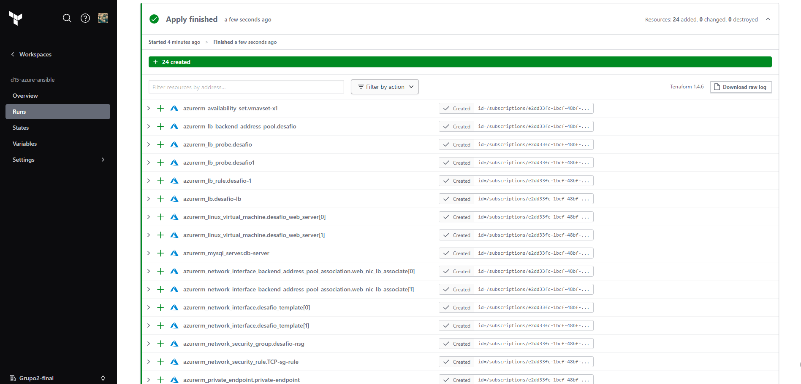
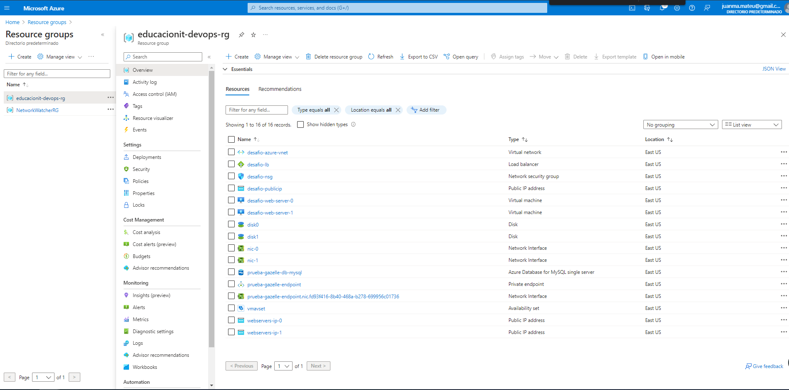
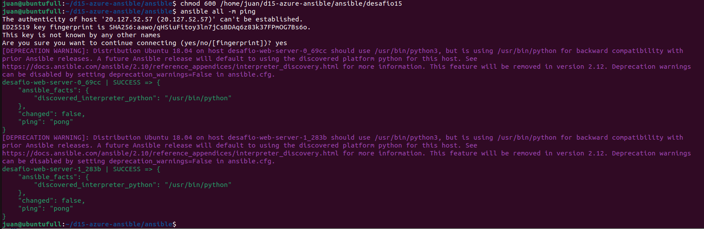
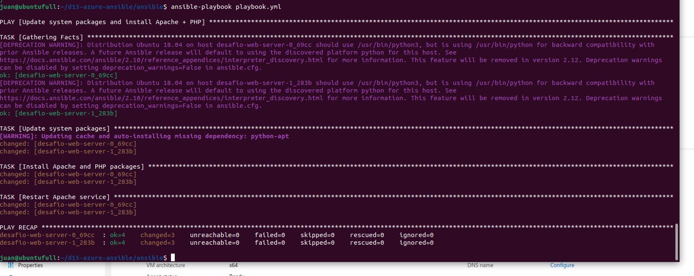

# Azure Web Server + azure Database for Mysql
## Iaac with terraform + Ansible

# Resultados

### Apply exitoso en terraform cloud

### Resource Group creado con los recursos correspondientes

### Azure Database for MySQL

### Ansible ping

### Ansible Update Playbook
